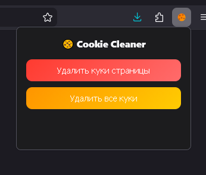

> **English version below** — [Read in English](README_EN.md)

# Cookie Cleaner

Простое расширение для Firefox, которое удаляет куки одним нажатием.

## Возможности

- **Удалить куки страницы** — удаляет все куки для текущего сайта (включая родительский домен) и перезагружает страницу
- **Удалить все куки** — очищает все куки в браузере

## Установка

Установить из [Firefox Add-ons (AMO)](https://addons.mozilla.org/firefox/addon/cookie-cleaner/).

## Ручная установка

1. Клонируйте репозиторий
2. Откройте `about:debugging#/runtime/this-firefox` в Firefox
3. Нажмите **Временное дополнение** и выберите `manifest.json`

## Разрешения

- `cookies` — чтение и удаление кук
- `activeTab` — доступ к URL текущей вкладки
- `<all_urls>` — удаление кук для любого домена

## Конфиденциальность

Расширение **не** собирает, не хранит и не передаёт никаких данных. См. [PRIVACY.md](PRIVACY.md).
